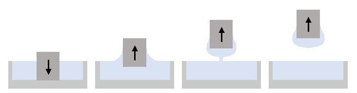

Getting Started
===============

.. currentmodule:: finitedepth

What is "finite depth dip coating"?
-----------------------------------

   The four stages of the finite depth dip coating.

**Finite depth dip coating** is a process in which a substrate is dipped into
a bath with relatively small immersion depth.

Unlike traditional dip coating, the coating layer in finite depth dip coating
is confined into a small portion of the substrate and thus the
lower edge effect dominates the system. The process consists of four stages:

#. Immersion
      In this initial stage, the substrate descends into the bath.
#. Withdrawal
      The substrate is gradually pulled out of the bath.
#. Pinch-off
      As the substrate exits the bath, a capillary bridge forms between the
      coating layer and the bulk fluid. The bridge then thins by pinch-off
      dynamics and eventually ruptures.
#. Termination
      Residual fluid is redistributed by surface tension.

To optimize the process, the effect of process variables to the layer profile
should be studied. This requires measuring the coating layer shape, and that's
what *DipcoatImage-FiniteDepth* is for.

.. _fundamentals:

Fundamentals
------------

Image analysis is performed based on two types of images; *reference image* and
*target image*. Reference image is an image of bare substrate, and target image
is an image of coated substrate.

.. plot::
   :context: reset
   :caption: Reference image (left) and target image (right).
      Red box is *substrate region*.

   import cv2, numpy as np, matplotlib.pyplot as plt
   from dipcoatimage.finitedepth import *
   data = dict(
      ref_path=get_data_path("ref3.png"),
      coat_path=get_data_path("coat3.mp4"),
      reference=dict(
         templateROI=(13, 10, 1246, 200),
         substrateROI=(100, 100, 1200, 500),
         draw_options=dict(
            templateROI=dict(linewidth=0),
            substrateROI=dict(color=(255, 0, 0), linewidth=4),
         ),
      ),
      coatinglayer=dict(
         deco_options=dict(layer=dict(facecolor=(0, 0, 0))),
      ),
   )
   config = data_converter.structure(data, Config)
   coat = config.construct_coatinglayer(0, False)

   _, axes = plt.subplots(1, 2, figsize=(6, 2.5))
   axes[0].imshow(coat.substrate.reference.draw(), cmap="gray")
   axes[0].axis("off")
   axes[1].imshow(coat.draw(), cmap="gray")
   axes[1].axis("off")
   plt.subplots_adjust(left=0, right=1, top=1, bottom=0)
   plt.show()

The basic scheme of analysis is:

#. Select substrate region from the reference image
   (red box in the previous figure).
#. Locate the substrate region in the target image.
#. Remove the substrate region from the target image to acquire
   coating layer region.

.. plot::
   :context: close-figs
   :caption: Coating layer region (blue) with substrate region removed.

   coat.draw_options.subtraction = coat.SubtractionMode.SUBSTRATE
   coat.deco_options.layer.facecolor = (69, 132, 182)
   plt.figure(figsize=(3, 2.5))
   plt.axis("off")
   plt.imshow(coat.draw())
   plt.tight_layout()

The coating layer region can be further processed to return desired data,
e.g., thickness and unifomity.

Installation
------------

DipcoatImage-FiniteDepth can be installed by :mod:`pip` from
github repository.

.. code-block:: bash

   pip install git+https://github.com/dipcoat-image/finitedepth.git

This installs the package with its latest commit. If you want a specific
version, append ``@[tag name]`` such as:

.. code-block:: bash

   pip install git+https://github.com/dipcoat-image/finitedepth.git@v1.0.0

Basic usage
-----------

DipcoatImage-FiniteDepth provides command-line API to invoke analysis using
configuration files.

.. code-block:: bash

   finitedepth analyze config1.yml config2.json ...

It can be run as a package as well:

.. code-block:: bash

   python -m dipcoatimage.finitedepth analyze config1.yml config2.json ...

The configuration file must contain entries which can construct
:class:`Config` instance.
Read :ref:`tutorial` for more information.

.. note::
   To check other commands, run:

   .. code-block:: bash

      finitedepth -h

   Or you can refer to :ref:`command-reference` page.

Alternatively, the package can be imported in runtime to perform analysis.
User can also extend its core classes to implement their own analysis.
See :ref:`howto` for detailed instructions.

Next steps
----------

Check out more resources to help you customize your analysis:

* Read :ref:`tutorial` for basic examples.
* :ref:`config-reference` will be helpful when you apply this package
  to analyze your dataset.
* :ref:`howto` provide advanced information to use 100% of
  DipcoatImage-FiniteDepth.
* :ref:`api` delineates every feature and component of this package.
* :ref:`explanation` are in-depth descriptions for developers.

Citation
--------

If you use this package in a scientific publication, please cite the following paper::

   @article{song2023measuring,
   title={Measuring coating layer shape in arbitrary geometry},
   author={Song, Jisoo and Yu, Dongkeun and Jo, Euihyun and Nam, Jaewook},
   journal={Physics of Fluids},
   volume={35},
   number={12},
   year={2023},
   publisher={AIP Publishing}
   }
