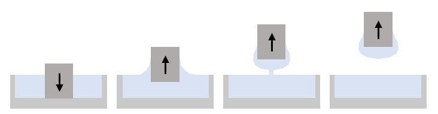
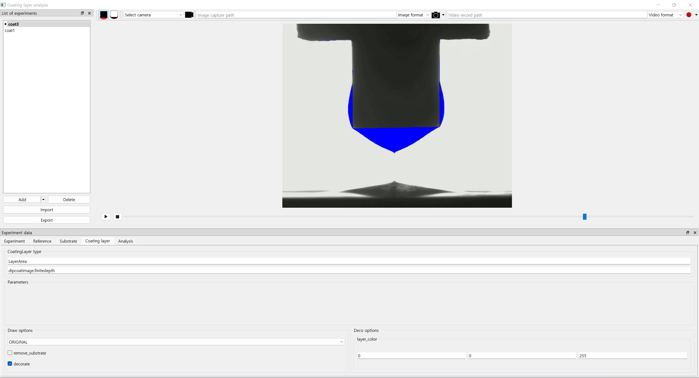

============
Introduction
============

.. currentmodule:: dipcoatimage.finitedepth

DipCoatImage-FiniteDepth is a Python package to perform image analysis on the coating layer shape from batch dip coating process with finite immersion depth.

Dip coating with finite depth is commonly used to partially apply liquid film onto a three-dimensional object.
The image below shows how the finite depth dip coating is performed.

   Finite depth dip coating process; immersion, deposition, termination and fluid redistribution.

The termination of the process is governed by the lower end effect of the system, where the capillary bridge is formed between the bulk fluid and the coating layer and soon ruptures.
After the capillary bridge breaks, coating layer changes its shape over time by fluid redistribution.
This temporal evolution of the coating layer must be analyzed to optimize the coating process.

Analysis images
===============

Two silhouette images are required to analyze the coating layer shape:

1. Bare substrate image
2. Coated substrate image

Below are the images of the bare substrate and the coated substrate from acutal coating process.

.. plot::
   :context: reset
   :caption: Bare substrate image(left) and coated substate image (right)
   :align: center

   import cv2, matplotlib.pyplot as plt
   from dipcoatimage.finitedepth import get_samples_path

   ref_path = get_samples_path("ref3.png")
   ref_img = cv2.imread(ref_path, cv2.IMREAD_GRAYSCALE)
   coat_path = get_samples_path("coat3.png")
   coat_img = cv2.imread(coat_path, cv2.IMREAD_GRAYSCALE)

   _, axes = plt.subplots(1, 2, figsize=(8, 4))
   axes[0].imshow(ref_img, cmap="gray")
   axes[0].axis("off")
   axes[1].imshow(coat_img, cmap="gray")
   axes[1].axis("off")
   plt.subplots_adjust(left=0, right=1, top=1, bottom=0)
   plt.show()

From these two images, the coating layer region can be extracted and further analyzed to yield the quantitative data (e.g., coating layer thickness).
Temporal evolution of the coating layer can be assessed by analyzing the series of coated substrate images from the coating process.

.. plot::
   :context: close-figs
   :caption: Coating layer region image
   :align: center

   from dipcoatimage.finitedepth import SubstrateReference, Substrate, LayerArea

   ref_img = cv2.cvtColor(cv2.imread(ref_path), cv2.COLOR_BGR2RGB)
   ref = SubstrateReference(ref_img, (100, 50, 1200, 200), (300, 100, 950, 600))
   subst = Substrate(ref)
   coat_img = cv2.cvtColor(cv2.imread(coat_path), cv2.COLOR_BGR2RGB)
   coat = LayerArea(coat_img, subst)
   coat.draw_options.remove_substrate = True

   plt.axis("off")
   plt.imshow(coat.draw())

Image processing classes
========================

:mod:`dipcoatimage.finitedepth` defines three kind of classes for image processing:

1. Substrate reference
2. Substrate
3. Coating layer

Substrate reference class
-------------------------

Substrate reference class(or in short, reference class) is a container for the bare substrate image and two ROIs; template ROI and substrate ROI.

The first ROI specifies the template region for the coating layer class, and the second specifies the substrate region for the substrate class.

.. plot::
   :context: reset
   :include-source:
   :caption: Template ROI (green) and substrate ROI (red) visuaized by :class:`.SubstrateReference`
   :align: center

   >>> import cv2
   >>> from dipcoatimage.finitedepth import get_samples_path, SubstrateReference
   >>> import matplotlib.pyplot as plt #doctest: +SKIP
   >>> ref_path = get_samples_path("ref3.png")
   >>> ref_img = cv2.cvtColor(cv2.imread(ref_path), cv2.COLOR_BGR2RGB)
   >>> templateROI, substrateROI = (100, 50, 1200, 200), (300, 100, 950, 600)
   >>> ref = SubstrateReference(ref_img, templateROI, substrateROI)
   >>> plt.imshow(ref.draw()) #doctest: +SKIP

Substrate class
---------------

Substrate class detects the geometry of the substrate.
It uses the substrate region from the substrate reference instance.

.. plot::
   :context: close-figs
   :include-source:
   :caption: Edge of the substrate (blue) detected by :class:`.RectSubstrate`
   :align: center

   >>> from dipcoatimage.finitedepth import RectSubstrate, data_converter
   >>> param_val = dict(Sigma=3.0, Theta=0.01)
   >>> param = data_converter.structure(param_val, RectSubstrate.Parameters)
   >>> subst = RectSubstrate(ref, parameters=param)
   >>> subst.draw_options.draw_lines = False
   >>> plt.imshow(subst.draw()) #doctest: +SKIP

Coating layer class
-------------------

Coating layer class extracts the coating layer region from the coated substrate image using the substrate instance.
It then retrieves quantitative data and visualized image from it.

To analyze the coating layer shape, the coating layer instance uses the substrate geometry information detected by the substrate instance.

.. plot::
   :context: close-figs
   :include-source:
   :caption: Coating layer region (blue) extracted by :class:`.LayerArea`
   :align: center

   >>> from dipcoatimage.finitedepth import LayerArea
   >>> coat_path = get_samples_path("coat3.png")
   >>> coat_img = cv2.cvtColor(cv2.imread(coat_path), cv2.COLOR_BGR2RGB)
   >>> coat = LayerArea(coat_img, subst)
   >>> coat.analyze()
   LayerAreaData(Area=41519)
   >>> coat.draw_options.subtract_mode = coat.SubtractionDrawMode.FULL
   >>> plt.imshow(coat.draw()) #doctest: +SKIP

Analysis classes
================

Analyzing the coating experiment usually involves processing multiple images(e.g., frames from the coating process video) of a coated substrate with respect to a single bare substrate image.

:mod:`dipcoatimage.finitedepth` provides systematic way to construct multiple coating layer instances, to save the analysis results, and to serialize the analysis parameters into file.

Experiment class
----------------

Experiment class is a factory for coating layer instance.

An experiment instance stores the parameters and constructs multiple coating layer instances from different images.
It can refer to the previous coating layer instance when constructing the new one, which allows different parameters to be applied to consecutive images.

.. plot::
   :context: close-figs
   :include-source:
   :caption: :class:`.LayerArea` instances constructed by :class:`.Experiment` with consecutive images
   :align: center

   >>> from dipcoatimage.finitedepth import Experiment
   >>> expt = Experiment(subst, LayerArea)
   >>> vid_path = get_samples_path("coat3.mp4")
   >>> cap = cv2.VideoCapture(vid_path); cap.set(cv2.CAP_PROP_POS_FRAMES, 11)
   True
   >>> _, img1 = cap.read(); _, img2 = cap.read(); cap.release()
   >>> coat1 = expt.construct_coatinglayer(img1)
   >>> coat2 = expt.construct_coatinglayer(img2, coat1)
   >>> plt.subplot(121); plt.imshow(coat1.draw()) #doctest: +SKIP
   >>> plt.subplot(122); plt.imshow(coat2.draw()) #doctest: +SKIP

Analyzer class
--------------

:class:`.Analyzer` collects the data and the visualized images from multiple coating layer instance, and saves them as files.

An analyzer instance orchestrates the construction and the analysis of the coating layer instances.
It defines which files to analyze and where to save the result, and performs the analysis.

>>> from dipcoatimage.finitedepth import Analyzer
>>> analyzer = Analyzer([vid_path], expt)
>>> analyzer.analyze(data_path="data.csv", video_path="video.mp4") #doctest: +SKIP
100%|████████████████████████████████████████████| 15/15 [00:01<00:00, 14.66it/s]

Experiment data class
---------------------

:class:`.ExperimentData` is a dataclass which describes a whole finite depth dip coating experiment.
It can also automatically construct a :class:`.Analyzer` instance from the data and perform the analysis.

Serializing and deserializing the experiment data can be done by :obj:`.data_converter`, which is a :class:`cattrs.Converter`.
This allows configuration for the analysis to be saved to and loaded from file.

>>> import os
>>> import yaml
>>> from dipcoatimage.finitedepth import data_converter, ExperimentData
>>> os.chdir(get_samples_path())
>>> with open(get_samples_path("config.yml")) as f:
...   parameters = yaml.load(f, Loader=yaml.FullLoader)
>>> for name, data in parameters.items(): #doctest: +SKIP
...   exptData = data_converter.structure(data, ExperimentData)
...   exptData.analyze(name)
coat1: 100%|█████████████████████████████████████| 1/1 [00:00<00:00,  7.55it/s]
coat3: 100%|█████████████████████████████████████| 15/15 [00:01<00:00, 14.37it/s]

GUI
===

:mod:`dipcoatimage.finitedepth_gui` provides the GUI to perform visualization and analysis.

   Finite depth analysis GUI

Its main features are:

1. Construct the classes from :mod:`dipcoatimage.finitedepth` by specifying the parameters and visualize them.
2. Save and load the serialized parameters.
3. Real-time visualization of the image stream from the camera.
4. Capturing the image and recording the video from the camera.
5. Analyzing the experiment using constructed classes and saving to file.

The following code runs the GUI.
Note that style sheet is set to highlight the mandatory field widgets.

.. code-block:: python

   from PySide6.QtWidgets import QApplication
   import sys
   from dipcoatimage.finitedepth_gui import MainWindow

   app = QApplication(sys.argv)
   app.setStyleSheet("*[requiresFieldValue=true]{border: 1px solid red}")
   window = MainWindow()
   window.show()
   app.exec()
   app.quit()
